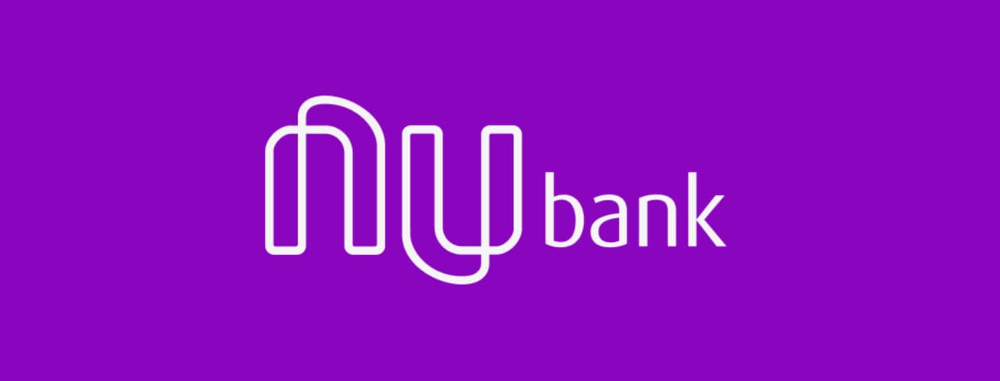
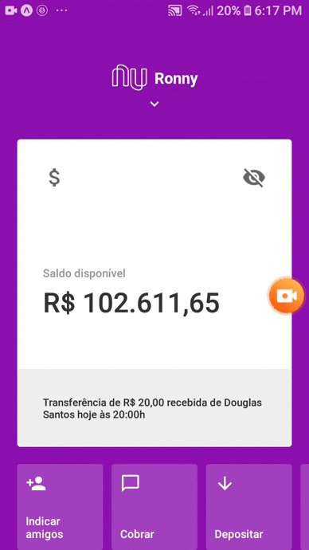

<h1 align="center">
  
   
</h1>

  

  

  

  

  

  

 

## 💻 Projeto

Esse projeto foi feito para treinar a minha habilidade de criação de UI's mobile com React Native. A interface do nubank foi escoolhida pela por muito bem feita e pelos seus gestos aplicados à Home screen!

 

## 📱 Preview

<h1 align="center">
    
</h1>

## 🚀 Tecnologias

- [React Native](https://facebook.github.io/react-native/)
- [Expo](https://expo.io/)
- [Styled Components](https://styled-components.com/)

  Made with 💜 by <a href="https://www.linkedin.com/in/ronnyacacio/"> Ronny Acácio </a>

